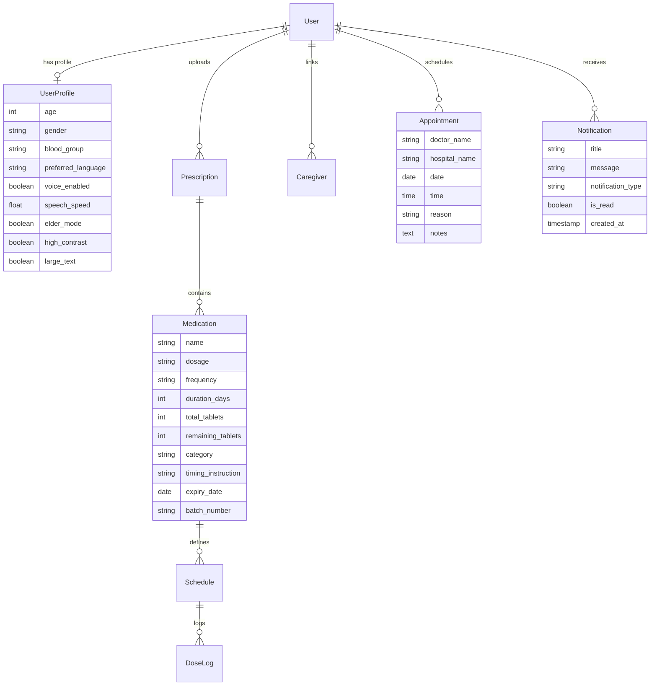

# MediMate: Smart AI Medication Assistant & Health Hub

MediMate is a professional-grade web application designed to transform medication management into a smart, accessible, and comprehensive healthcare ecosystem. Utilizing React, Django, and the browser's built-in Web Speech API, MediMate caters to diverse patient needs (including elderly users, visually impaired individuals, and caregivers) while offering intelligent prescription OCR processing, detailed analytics, inventory tracking, and doctor appointment scheduling.

---

## 📂 Folder Structure

```
Medimate/
├── backend/
│   ├── api/
│   │   ├── serializers.py    # Serializers for User, Medication, Caregivers, etc.
│   │   ├── views.py          # Viewsets and custom API views (OCR, Refills, Analytics)
│   │   └── urls.py           # API endpoint routing
│   ├── core/
│   │   ├── models.py         # Database models (Medication, Caregiver, Appointment, Notification)
│   │   ├── services/
│   │   │   ├── ocr_service.py # OCR parsing service using PyTesseract
│   │   │   └── nlp_service.py # Fuzzy matching NLP parsing for instructions
│   │   └── migrations/
│   └── manage.py
├── frontend/
│   ├── src/
│   │   ├── components/
│   │   │   ├── Header.jsx       # Header containing Notification Center dropdown
│   │   │   ├── BottomNav.jsx    # Responsive mobile navigation tabs
│   │   │   └── Toast.jsx        # Notification feedback banner system
│   │   ├── context/
│   │   │   └── AccessibilityContext.jsx # Global Elder/Contrast/Large Text styling provider
│   │   ├── translations/
│   │   │   └── index.js         # Multilingual translation dictionary (EN/HI/KN/TA/TE/ML)
│   │   ├── services/
│   │   │   ├── api.js           # Axios instance with auth tokens
│   │   │   └── voiceService.js  # TTS and Voice Command Speech API handlers
│   │   ├── screens/
│   │   │   ├── Home.jsx         # Today's grouped schedule list with Voice controls
│   │   │   ├── Medications.jsx  # Medicine search, filters, details expand, & restock
│   │   │   ├── AddPrescription.jsx # Smart OCR Image/PDF upload review form
│   │   │   ├── Dashboard.jsx    # Health Summary, Heatmaps, Timelines, & Appointments
│   │   │   └── Settings.jsx     # Accessibility, Voice, Caregivers, Backup/Restore
│   │   └── App.jsx
│   └── package.json
```

---

## 🛠️ Database Structure



---

## 🚀 Key Features

1. **AI Prescription Intelligence**: Supporting multi-format file uploads (Image + PDF) with fuzzy-matching text parsing to automatically extract medication name, dosage, category, duration, food badge, and time slot schedules.
2. **Notification Center Overlay**: Live alerts for missed doses, refills, upcoming appointments, and expiry notifications linked to caregiver updates.
3. **Advanced Visual Analytics**: Interactive monthly heatmap grids, current/longest streaks, weekly adherence bar charts, and courses timeline.
4. **Smart Voice & Multilingual Hub**: Native Speech Synthesis and Recognition matching voice commands ("Taken", "Skip", "Snooze") and reading out card descriptions in 6 native languages (English, Hindi, Kannada, Tamil, Telugu, Malayalam).
5. **Accessibility Suite**: Dynamic UI overrides for **Elder Mode** (enlarged clickable buttons & targets), High Contrast (dark accessibility stylesheet), and Zoomed Large Text.
6. **Caregiver Portals & Missed Alerts**: Links family caregivers and sends email alerts instantly if a patient misses 3 consecutive doses.
7. **Refills & Backup Tools**: JSON data backups download/upload tools, restock markers, and printable Excel CSV reports.

---

## 📡 API Documentation

### 1. Caregivers Endpoints
* **`GET /api/caregivers/`**: List linked caregivers.
* **`POST /api/caregivers/`**: Add a caregiver.
* **`DELETE /api/caregivers/<id>/`**: Delete a caregiver contact.

### 2. Appointments Endpoints
* **`GET /api/appointments/`**: List upcoming appointments.
* **`POST /api/appointments/`**: Book a doctor visit.
* **`DELETE /api/appointments/<id>/`**: Cancel an appointment.

### 3. Notifications Endpoints
* **`GET /api/notifications/`**: Retrieve active notifications.
* **`PATCH /api/notifications/<id>/read/`**: Mark a notification as read.
* **`DELETE /api/notifications/clear/`**: Clear all notifications.

### 4. Backup & Reports Endpoints
* **`GET /api/reports/export/`**: Export complete health adherence report as an Excel-ready CSV.
* **`GET /api/settings/backup/`**: Download the current database state as a JSON file.
* **`POST /api/settings/restore/`**: Upload a backup JSON file to restore database status.

---

## 🛠️ Installation Guide

### Prerequisites
- Python 3.8+ & Pip
- Node.js & NPM
- Tesseract OCR engine (optional, fallback sample text is provided if binary is missing)

### Running Backend Server
```bash
cd backend
python -m venv venv
# On Windows
.\venv\Scripts\activate
# Install requirements
pip install -r requirements.txt
python manage.py makemigrations
python manage.py migrate
python manage.py runserver
```

### Running Frontend React Server
```bash
cd frontend
npm install
npm run dev
```

---

## 🔮 Future Scope
1. **IoT Smart Pillbox Integration**: Syncing physical pillboxes with real-time API state updates.
2. **AI Health Chatbots**: Direct chat interface matching user analytics data.
3. **Pill Identification OCR**: Real-time camera recognition matching medicine shape, color, and imprints.
